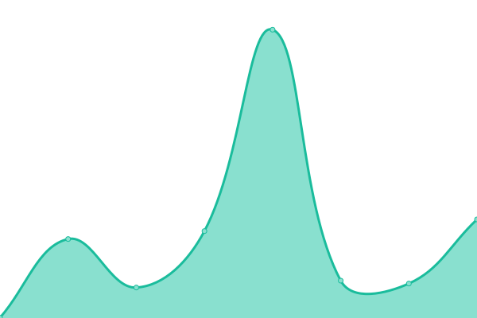
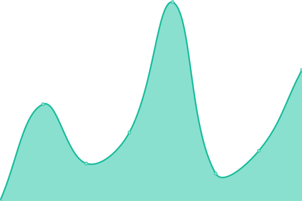
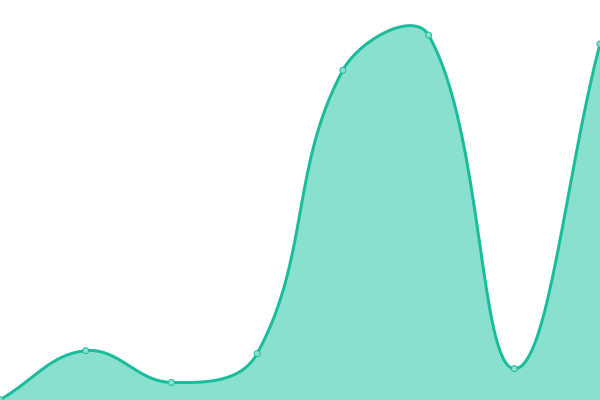
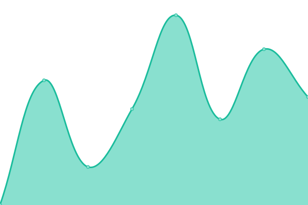
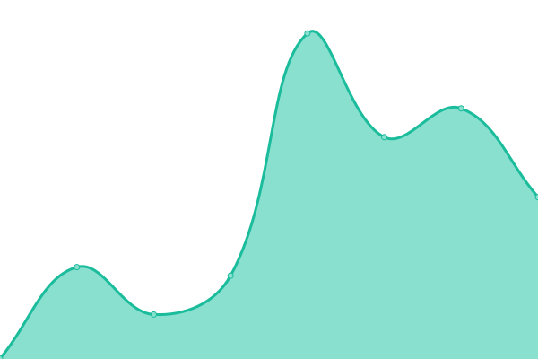
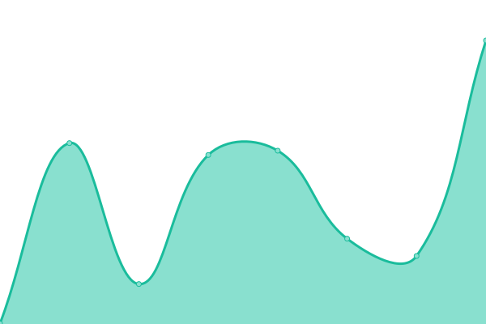
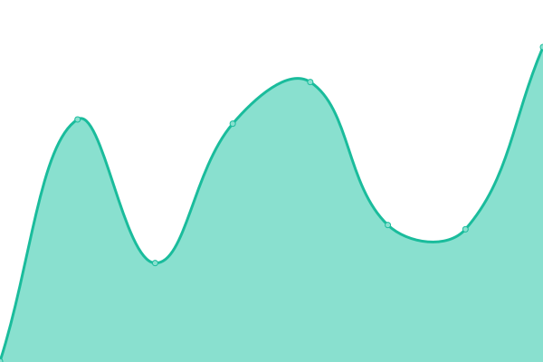

# [📈 Live Status](https://uptime.wtftechsolutions.com): <!--live status--> **🟧 Partial outage**

This repository contains the open-source uptime monitor and status page for [Eric Kuznacic](https://www.erickuznacic.com), powered by [Upptime](https://github.com/upptime/upptime).

With [Upptime](https://upptime.js.org), you can get your own unlimited and free uptime monitor and status page, powered entirely by a GitHub repository. We use [Issues](https://github.com/kuznacic/wtf-uptime/issues) as incident reports, [Actions](https://github.com/kuznacic/wtf-uptime/actions) as uptime monitors, and [Pages](https://uptime.wtftechsolutions.com) for the status page.

<!--start: status pages-->
<!-- This summary is generated by Upptime (https://github.com/upptime/upptime) -->
<!-- Do not edit this manually, your changes will be overwritten -->
<!-- prettier-ignore -->
| URL | Status | History | Response Time | Uptime |
| --- | ------ | ------- | ------------- | ------ |
|  [Alive Wellness Group](https://alivewellnessgroup.com) | 🟩 Up | [alive-wellness-group.yml](https://github.com/kuznacic/wtf-uptime/commits/HEAD/history/alive-wellness-group.yml) | 

 302ms
     
 | 

<a href="https://uptime.wtftechsolutions.com/history/alive-wellness-group">100.00%</a>
    

|  [Badger Hardwood](https://www.badgerwood.com) | 🟩 Up | [badger-hardwood.yml](https://github.com/kuznacic/wtf-uptime/commits/HEAD/history/badger-hardwood.yml) | 

 255ms
     
 | 

<a href="https://uptime.wtftechsolutions.com/history/badger-hardwood">100.00%</a>
    

|  [Better Brodhead](https://betterbrodhead.org) | 🟩 Up | [better-brodhead.yml](https://github.com/kuznacic/wtf-uptime/commits/HEAD/history/better-brodhead.yml) | 

 241ms
     
 | 

<a href="https://uptime.wtftechsolutions.com/history/better-brodhead">100.00%</a>
    

|  [Biohackers Fitness](https://biohackersfitness.com) | 🟩 Up | [biohackers-fitness.yml](https://github.com/kuznacic/wtf-uptime/commits/HEAD/history/biohackers-fitness.yml) | 

 291ms
     
 | 

<a href="https://uptime.wtftechsolutions.com/history/biohackers-fitness">100.00%</a>
    

|  [Biohackers Warehouse](https://biohackerswarehouse.com) | 🟩 Up | [biohackers-warehouse.yml](https://github.com/kuznacic/wtf-uptime/commits/HEAD/history/biohackers-warehouse.yml) | 

 384ms
     
 | 

<a href="https://uptime.wtftechsolutions.com/history/biohackers-warehouse">100.00%</a>
    

|  [Break-Free Health & Wellness](https://breakfree-healthandwellness.com) | 🟩 Up | [break-free-health-and-wellness.yml](https://github.com/kuznacic/wtf-uptime/commits/HEAD/history/break-free-health-and-wellness.yml) | 

 304ms
     
 | 

<a href="https://uptime.wtftechsolutions.com/history/break-free-health-and-wellness">100.00%</a>
    

|  [Cecelia's Golf Course](https://ceceliasgolf.com) | 🟩 Up | [cecelia-s-golf-course.yml](https://github.com/kuznacic/wtf-uptime/commits/HEAD/history/cecelia-s-golf-course.yml) | 

 219ms
     
 | 

<a href="https://uptime.wtftechsolutions.com/history/cecelia-s-golf-course">100.00%</a>
    

|  [Community Foundation of Southern Wisconsin](https://cfsw.org) | 🟩 Up | [community-foundation-of-southern-wisconsin.yml](https://github.com/kuznacic/wtf-uptime/commits/HEAD/history/community-foundation-of-southern-wisconsin.yml) | 

 350ms
     
 | 

<a href="https://uptime.wtftechsolutions.com/history/community-foundation-of-southern-wisconsin">100.00%</a>
    

|  [CG Ministry](https://www.cgministry-inchrist.com) | 🟩 Up | [cg-ministry.yml](https://github.com/kuznacic/wtf-uptime/commits/HEAD/history/cg-ministry.yml) | 

 368ms
     
 | 

<a href="https://uptime.wtftechsolutions.com/history/cg-ministry">100.00%</a>
    

|  [Children's Museum of Rock County](https://kidsatplayrc.com) | 🟩 Up | [children-s-museum-of-rock-county.yml](https://github.com/kuznacic/wtf-uptime/commits/HEAD/history/children-s-museum-of-rock-county.yml) | 

 249ms
     
 | 

<a href="https://uptime.wtftechsolutions.com/history/children-s-museum-of-rock-county">100.00%</a>
    

|  [Colecago](https://blog.colecago.com) | 🟩 Up | [colecago.yml](https://github.com/kuznacic/wtf-uptime/commits/HEAD/history/colecago.yml) | 

 302ms
     
 | 

<a href="https://uptime.wtftechsolutions.com/history/colecago">100.00%</a>
    

|  [Coming Through The Fog](https://www.comingthroughthefog.com) | 🟩 Up | [coming-through-the-fog.yml](https://github.com/kuznacic/wtf-uptime/commits/HEAD/history/coming-through-the-fog.yml) | 

 206ms
     
 | 

<a href="https://uptime.wtftechsolutions.com/history/coming-through-the-fog">100.00%</a>
    

|  [Community Action, Inc. (hosted elsewhere)](https://community-action.org) | 🟩 Up | [community-action-inc-hosted-elsewhere.yml](https://github.com/kuznacic/wtf-uptime/commits/HEAD/history/community-action-inc-hosted-elsewhere.yml) | 

 517ms
     
 | 

<a href="https://uptime.wtftechsolutions.com/history/community-action-inc-hosted-elsewhere">100.00%</a>
    

|  [Community Health Systems](https://www.chsofwi.org) | 🟩 Up | [community-health-systems.yml](https://github.com/kuznacic/wtf-uptime/commits/HEAD/history/community-health-systems.yml) | 

 467ms
     
 | 

<a href="https://uptime.wtftechsolutions.com/history/community-health-systems">100.00%</a>
    

|  [Cornerstone of Hope](https://csohwi.com) | 🟩 Up | [cornerstone-of-hope.yml](https://github.com/kuznacic/wtf-uptime/commits/HEAD/history/cornerstone-of-hope.yml) | 

 320ms
     
 | 

<a href="https://uptime.wtftechsolutions.com/history/cornerstone-of-hope">100.00%</a>
    

|  [Crist Real Estate Group](https://cristrealestategroup.com) | 🟩 Up | [crist-real-estate-group.yml](https://github.com/kuznacic/wtf-uptime/commits/HEAD/history/crist-real-estate-group.yml) | 

 321ms
     
 | 

<a href="https://uptime.wtftechsolutions.com/history/crist-real-estate-group">100.00%</a>
    

|  [Diversity Action Team](https://www.datrockco.org) | 🟩 Up | [diversity-action-team.yml](https://github.com/kuznacic/wtf-uptime/commits/HEAD/history/diversity-action-team.yml) | 

 338ms
     
 | 

<a href="https://uptime.wtftechsolutions.com/history/diversity-action-team">100.00%</a>
    

|  [Don Vruwink for Assembly](https://donvruwinkforassembly.com) | 🟩 Up | [don-vruwink-for-assembly.yml](https://github.com/kuznacic/wtf-uptime/commits/HEAD/history/don-vruwink-for-assembly.yml) | 

 256ms
     
 | 

<a href="https://uptime.wtftechsolutions.com/history/don-vruwink-for-assembly">100.00%</a>
    

|  [Earthsong Books and Gifts](https://earthsongbooksandgifts.com) | 🟩 Up | [earthsong-books-and-gifts.yml](https://github.com/kuznacic/wtf-uptime/commits/HEAD/history/earthsong-books-and-gifts.yml) | 

 217ms
     
 | 

<a href="https://uptime.wtftechsolutions.com/history/earthsong-books-and-gifts">100.00%</a>
    

|  [ECHO of Janesville](https://echojanesville.org) | 🟩 Up | [echo-of-janesville.yml](https://github.com/kuznacic/wtf-uptime/commits/HEAD/history/echo-of-janesville.yml) | 

 274ms
     
 | 

<a href="https://uptime.wtftechsolutions.com/history/echo-of-janesville">100.00%</a>
    

|  [Foundation for the Preservation of 108 South Jackson](https://www.janesvillewomansclub.com) | 🟩 Up | [foundation-for-the-preservation-of-108-south-jackson.yml](https://github.com/kuznacic/wtf-uptime/commits/HEAD/history/foundation-for-the-preservation-of-108-south-jackson.yml) | 

 330ms
     
 | 

<a href="https://uptime.wtftechsolutions.com/history/foundation-for-the-preservation-of-108-south-jackson">100.00%</a>
    

|  [Friends of Riverside Park](https://jvlriversidepark.com) | 🟩 Up | [friends-of-riverside-park.yml](https://github.com/kuznacic/wtf-uptime/commits/HEAD/history/friends-of-riverside-park.yml) | 

 195ms
     
 | 

<a href="https://uptime.wtftechsolutions.com/history/friends-of-riverside-park">100.00%</a>
    

|  [Go Wisconsin Global](https://www.gowisconsinglobal.org) | 🟩 Up | [go-wisconsin-global.yml](https://github.com/kuznacic/wtf-uptime/commits/HEAD/history/go-wisconsin-global.yml) | 

 1383ms
     
 | 

<a href="https://uptime.wtftechsolutions.com/history/go-wisconsin-global">100.00%</a>
    

|  [Grace Evangelical Free Church](https://graceevangelicalfree.org) | 🟩 Up | [grace-evangelical-free-church.yml](https://github.com/kuznacic/wtf-uptime/commits/HEAD/history/grace-evangelical-free-church.yml) | 

 363ms
     
 | 

<a href="https://uptime.wtftechsolutions.com/history/grace-evangelical-free-church">100.00%</a>
    

|  [HealthNet of Rock County](http://www.healthnet-rock.org) | 🟩 Up | [health-net-of-rock-county.yml](https://github.com/kuznacic/wtf-uptime/commits/HEAD/history/health-net-of-rock-county.yml) | 

 660ms
     
 | 

<a href="https://uptime.wtftechsolutions.com/history/health-net-of-rock-county">100.00%</a>
    

|  [High Class Grass](https://high-classgrass.com) | 🟩 Up | [high-class-grass.yml](https://github.com/kuznacic/wtf-uptime/commits/HEAD/history/high-class-grass.yml) | 

 262ms
     
 | 

<a href="https://uptime.wtftechsolutions.com/history/high-class-grass">100.00%</a>
    

|  [HOPE Child & Family Counseling](https://hopechildandfamilycounseling.com) | 🟩 Up | [hope-child-and-family-counseling.yml](https://github.com/kuznacic/wtf-uptime/commits/HEAD/history/hope-child-and-family-counseling.yml) | 

 293ms
     
 | 

<a href="https://uptime.wtftechsolutions.com/history/hope-child-and-family-counseling">100.00%</a>
    

|  [Hunt-N-Gear](https://huntngearonline.com) | 🟩 Up | [hunt-n-gear.yml](https://github.com/kuznacic/wtf-uptime/commits/HEAD/history/hunt-n-gear.yml) | 

 714ms
     
 | 

<a href="https://uptime.wtftechsolutions.com/history/hunt-n-gear">100.00%</a>
    

|  [Impact Confections](https://impactconfections.com) | 🟩 Up | [impact-confections.yml](https://github.com/kuznacic/wtf-uptime/commits/HEAD/history/impact-confections.yml) | 

 291ms
     
 | 

<a href="https://uptime.wtftechsolutions.com/history/impact-confections">100.00%</a>
    

|  [Inside The Mind Of Eric Kuznacic](https://erickuznacic.com) | 🟩 Up | [inside-the-mind-of-eric-kuznacic.yml](https://github.com/kuznacic/wtf-uptime/commits/HEAD/history/inside-the-mind-of-eric-kuznacic.yml) | 

 490ms
     
 | 

<a href="https://uptime.wtftechsolutions.com/history/inside-the-mind-of-eric-kuznacic">100.00%</a>
    

|  [IV Careers](https://ivcareers.com) | 🟩 Up | [iv-careers.yml](https://github.com/kuznacic/wtf-uptime/commits/HEAD/history/iv-careers.yml) | 

 247ms
     
 | 

<a href="https://uptime.wtftechsolutions.com/history/iv-careers">100.00%</a>
    

|  [Janesville Lions Club](https://janesvillelions.org) | 🟩 Up | [janesville-lions-club.yml](https://github.com/kuznacic/wtf-uptime/commits/HEAD/history/janesville-lions-club.yml) | 

 355ms
     
 | 

<a href="https://uptime.wtftechsolutions.com/history/janesville-lions-club">100.00%</a>
    

|  [Jeffris Foundation](https://www.jeffrisfoundation.org) | 🟩 Up | [jeffris-foundation.yml](https://github.com/kuznacic/wtf-uptime/commits/HEAD/history/jeffris-foundation.yml) | 

 264ms
     
 | 

<a href="https://uptime.wtftechsolutions.com/history/jeffris-foundation">100.00%</a>
    

|  [JLA Architects](https://jla-ap.com) | 🟩 Up | [jla-architects.yml](https://github.com/kuznacic/wtf-uptime/commits/HEAD/history/jla-architects.yml) | 

 309ms
     
 | 

<a href="https://uptime.wtftechsolutions.com/history/jla-architects">100.00%</a>
    

|  [Ken Johnson DDS](https://www.kenjohnsondds.com) | 🟩 Up | [ken-johnson-dds.yml](https://github.com/kuznacic/wtf-uptime/commits/HEAD/history/ken-johnson-dds.yml) | 

 186ms
     
 | 

<a href="https://uptime.wtftechsolutions.com/history/ken-johnson-dds">100.00%</a>
    

|  [Ketamine Health Centers](https://ketaminehealthcenters.com) | 🟩 Up | [ketamine-health-centers.yml](https://github.com/kuznacic/wtf-uptime/commits/HEAD/history/ketamine-health-centers.yml) | 

 385ms
     
 | 

<a href="https://uptime.wtftechsolutions.com/history/ketamine-health-centers">100.00%</a>
    

|  [Leadership Development Academy](http://ldarock.com) | 🟩 Up | [leadership-development-academy.yml](https://github.com/kuznacic/wtf-uptime/commits/HEAD/history/leadership-development-academy.yml) | 

 444ms
     
 | 

<a href="https://uptime.wtftechsolutions.com/history/leadership-development-academy">100.00%</a>
    

|  [Little Luzon](https://littleluzon.com) | 🟩 Up | [little-luzon.yml](https://github.com/kuznacic/wtf-uptime/commits/HEAD/history/little-luzon.yml) | 

 302ms
     
 | 

<a href="https://uptime.wtftechsolutions.com/history/little-luzon">100.00%</a>
    

|  [LWML-NID](https://lwmlnid.org) | 🟩 Up | [lwml-nid.yml](https://github.com/kuznacic/wtf-uptime/commits/HEAD/history/lwml-nid.yml) | 

 255ms
     
 | 

<a href="https://uptime.wtftechsolutions.com/history/lwml-nid">100.00%</a>
    

|  [Maker Matt Home](http://www.makermatthome.com) | 🟩 Up | [maker-matt-home.yml](https://github.com/kuznacic/wtf-uptime/commits/HEAD/history/maker-matt-home.yml) | 

 250ms
     
 | 

<a href="https://uptime.wtftechsolutions.com/history/maker-matt-home">100.00%</a>
    

|  [Midwest Veterinary Dental Services](https://www.midwestvetdental.com) | 🟩 Up | [midwest-veterinary-dental-services.yml](https://github.com/kuznacic/wtf-uptime/commits/HEAD/history/midwest-veterinary-dental-services.yml) | 

 399ms
     
 | 

<a href="https://uptime.wtftechsolutions.com/history/midwest-veterinary-dental-services">100.00%</a>
    

|  [Milwaukee Grill](https://milwaukeegrill.com) | 🟩 Up | [milwaukee-grill.yml](https://github.com/kuznacic/wtf-uptime/commits/HEAD/history/milwaukee-grill.yml) | 

 200ms
     
 | 

<a href="https://uptime.wtftechsolutions.com/history/milwaukee-grill">100.00%</a>
    

|  [New York Juvenile Asylum](https://newyorkjuvenileasylum.com) | 🟩 Up | [new-york-juvenile-asylum.yml](https://github.com/kuznacic/wtf-uptime/commits/HEAD/history/new-york-juvenile-asylum.yml) | 

 386ms
     
 | 

<a href="https://uptime.wtftechsolutions.com/history/new-york-juvenile-asylum">100.00%</a>
    

|  [Pink Houses](https://pinkhouses.net) | 🟩 Up | [pink-houses.yml](https://github.com/kuznacic/wtf-uptime/commits/HEAD/history/pink-houses.yml) | 

 230ms
     
 | 

<a href="https://uptime.wtftechsolutions.com/history/pink-houses">100.00%</a>
    

|  [Project 16:49](https://project1649.org) | 🟩 Up | [project-16-49.yml](https://github.com/kuznacic/wtf-uptime/commits/HEAD/history/project-16-49.yml) | 

 343ms
     
 | 

<a href="https://uptime.wtftechsolutions.com/history/project-16-49">100.00%</a>
    

|  [Quivering Moon](http://www.quiveringmoon.com) | 🟩 Up | [quivering-moon.yml](https://github.com/kuznacic/wtf-uptime/commits/HEAD/history/quivering-moon.yml) | 

 395ms
     
 | 

<a href="https://uptime.wtftechsolutions.com/history/quivering-moon">100.00%</a>
    

|  [RBG Holiday Light Show](https://rbgholidaylightshow.com) | 🟥 Down | [rbg-holiday-light-show.yml](https://github.com/kuznacic/wtf-uptime/commits/HEAD/history/rbg-holiday-light-show.yml) | 

 2541ms
     
 | 

<a href="https://uptime.wtftechsolutions.com/history/rbg-holiday-light-show">0.21%</a>
    

|  [Rock Co. Historical Society](https://rchs.us) | 🟥 Down | [rock-co-historical-society.yml](https://github.com/kuznacic/wtf-uptime/commits/HEAD/history/rock-co-historical-society.yml) | 

 109ms
     
 | 

<a href="https://uptime.wtftechsolutions.com/history/rock-co-historical-society">100.00%</a>
    

|  [Rock Co. Rifle & Pistol Club](http://www.rcrpc.com) | 🟩 Up | [rock-co-rifle-and-pistol-club.yml](https://github.com/kuznacic/wtf-uptime/commits/HEAD/history/rock-co-rifle-and-pistol-club.yml) | 

 229ms
     
 | 

<a href="https://uptime.wtftechsolutions.com/history/rock-co-rifle-and-pistol-club">100.00%</a>
    

|  [Rock County Shot](https://rockcountyshot.com) | 🟩 Up | [rock-county-shot.yml](https://github.com/kuznacic/wtf-uptime/commits/HEAD/history/rock-county-shot.yml) | 

 285ms
     
 | 

<a href="https://uptime.wtftechsolutions.com/history/rock-county-shot">100.00%</a>
    

|  [Rock Valley HVAC](https://rvhvacinc.com) | 🟩 Up | [rock-valley-hvac.yml](https://github.com/kuznacic/wtf-uptime/commits/HEAD/history/rock-valley-hvac.yml) | 

 400ms
     
 | 

<a href="https://uptime.wtftechsolutions.com/history/rock-valley-hvac">100.00%</a>
    

|  [Rotary Botanical Gardens](https://rotarybotanicalgardens.org) | 🟩 Up | [rotary-botanical-gardens.yml](https://github.com/kuznacic/wtf-uptime/commits/HEAD/history/rotary-botanical-gardens.yml) | 

 225ms
     
 | 

<a href="https://uptime.wtftechsolutions.com/history/rotary-botanical-gardens">100.00%</a>
    

|  [SMR Photography](https://www.smrphotography.com) | 🟩 Up | [smr-photography.yml](https://github.com/kuznacic/wtf-uptime/commits/HEAD/history/smr-photography.yml) | 

 371ms
     
 | 

<a href="https://uptime.wtftechsolutions.com/history/smr-photography">100.00%</a>
    

|  [St. John Lutheran Church](https://www.sjlc-elca.org) | 🟩 Up | [st-john-lutheran-church.yml](https://github.com/kuznacic/wtf-uptime/commits/HEAD/history/st-john-lutheran-church.yml) | 

 231ms
     
 | 

<a href="https://uptime.wtftechsolutions.com/history/st-john-lutheran-church">100.00%</a>
    

|  [SummerStage of Delafield](https://summerstageofdelafield.org) | 🟩 Up | [summer-stage-of-delafield.yml](https://github.com/kuznacic/wtf-uptime/commits/HEAD/history/summer-stage-of-delafield.yml) | 

 318ms
     
 | 

<a href="https://uptime.wtftechsolutions.com/history/summer-stage-of-delafield">100.00%</a>
    

|  [Tessagen](http://www.tessagen.com) | 🟩 Up | [tessagen.yml](https://github.com/kuznacic/wtf-uptime/commits/HEAD/history/tessagen.yml) | 

 337ms
     
 | 

<a href="https://uptime.wtftechsolutions.com/history/tessagen">100.00%</a>
    

|  [The Booch Witch](https://boochwitch.com) | 🟩 Up | [the-booch-witch.yml](https://github.com/kuznacic/wtf-uptime/commits/HEAD/history/the-booch-witch.yml) | 

 287ms
     
 | 

<a href="https://uptime.wtftechsolutions.com/history/the-booch-witch">100.00%</a>
    

|  [Town of Eau Galle](https://www.townofeaugalle.org) | 🟩 Up | [town-of-eau-galle.yml](https://github.com/kuznacic/wtf-uptime/commits/HEAD/history/town-of-eau-galle.yml) | 

 251ms
     
 | 

<a href="https://uptime.wtftechsolutions.com/history/town-of-eau-galle">100.00%</a>
    

|  [United Way Blackhawk Region](https://liveunitedbr.org) | 🟩 Up | [united-way-blackhawk-region.yml](https://github.com/kuznacic/wtf-uptime/commits/HEAD/history/united-way-blackhawk-region.yml) | 

 392ms
     
 | 

<a href="https://uptime.wtftechsolutions.com/history/united-way-blackhawk-region">100.00%</a>
    

|  [US Stem Cell Clinic](https://usstemcellclinic.com) | 🟩 Up | [us-stem-cell-clinic.yml](https://github.com/kuznacic/wtf-uptime/commits/HEAD/history/us-stem-cell-clinic.yml) | 

 337ms
     
 | 

<a href="https://uptime.wtftechsolutions.com/history/us-stem-cell-clinic">100.00%</a>
    

|  [Waukesha Co. Community Foundation](https://waukeshafoundation.org) | 🟩 Up | [waukesha-co-community-foundation.yml](https://github.com/kuznacic/wtf-uptime/commits/HEAD/history/waukesha-co-community-foundation.yml) | 

 830ms
     
 | 

<a href="https://uptime.wtftechsolutions.com/history/waukesha-co-community-foundation">99.85%</a>
    

|  [WFVC](https://www.wisconsinforvaccinechoice.org) | 🟩 Up | [wfvc.yml](https://github.com/kuznacic/wtf-uptime/commits/HEAD/history/wfvc.yml) | 

 231ms
     
 | 

<a href="https://uptime.wtftechsolutions.com/history/wfvc">100.00%</a>
    

|  [Why The Fuss? Technical Solutions](https://wtftechsolutions.com) | 🟩 Up | [why-the-fuss-technical-solutions.yml](https://github.com/kuznacic/wtf-uptime/commits/HEAD/history/why-the-fuss-technical-solutions.yml) | 

 209ms
     
 | 

<a href="https://uptime.wtftechsolutions.com/history/why-the-fuss-technical-solutions">100.00%</a>
    

|  [WTF? Hosting](https://whythefusshosting.com) | 🟩 Up | [wtf-hosting.yml](https://github.com/kuznacic/wtf-uptime/commits/HEAD/history/wtf-hosting.yml) | 

 899ms
     
 | 

<a href="https://uptime.wtftechsolutions.com/history/wtf-hosting">100.00%</a>
    

<!--end: status pages-->

[**Visit our status website →**](https://uptime.wtftechsolutions.com)

## 📄 License

- Powered by: [Upptime](https://github.com/upptime/upptime)
- Code: [MIT](./LICENSE) © [Eric Kuznacic](https://www.erickuznacic.com)
- Data in the `./history` directory: [Open Database License](https://opendatacommons.org/licenses/odbl/1-0/)
