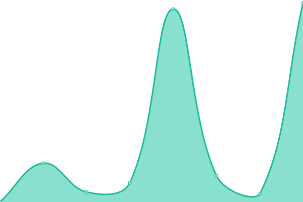
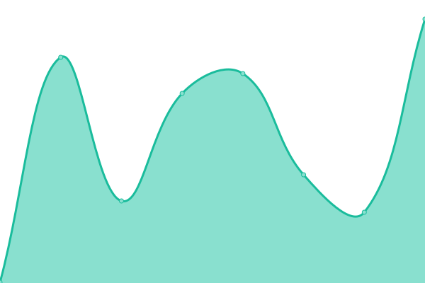
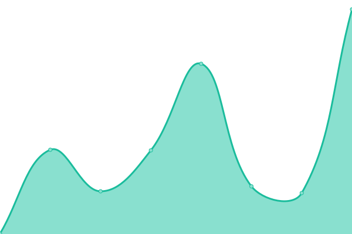
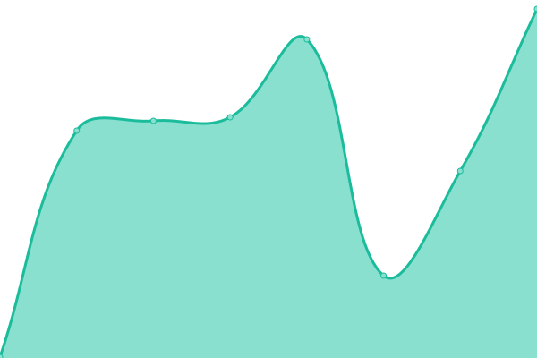

# [📈 Live Status](https://uptime.wtftechsolutions.com): <!--live status--> **🟧 Partial outage**

This repository contains the open-source uptime monitor and status page for [Eric Kuznacic](https://www.erickuznacic.com), powered by [Upptime](https://github.com/upptime/upptime).

With [Upptime](https://upptime.js.org), you can get your own unlimited and free uptime monitor and status page, powered entirely by a GitHub repository. We use [Issues](https://github.com/kuznacic/wtf-uptime/issues) as incident reports, [Actions](https://github.com/kuznacic/wtf-uptime/actions) as uptime monitors, and [Pages](https://uptime.wtftechsolutions.com) for the status page.

<!--start: status pages-->
<!-- This summary is generated by Upptime (https://github.com/upptime/upptime) -->
<!-- Do not edit this manually, your changes will be overwritten -->
<!-- prettier-ignore -->
| URL | Status | History | Response Time | Uptime |
| --- | ------ | ------- | ------------- | ------ |
|  [Why The Fuss? Technical Solutions](https://wtftechsolutions.com) | 🟩 Up | [why-the-fuss-technical-solutions.yml](https://github.com/kuznacic/wtf-uptime/commits/HEAD/history/why-the-fuss-technical-solutions.yml) | 

 233ms
     
 | 

<a href="https://uptime.wtftechsolutions.com/history/why-the-fuss-technical-solutions">100.00%</a>
    

|  [Inside The Mind Of Eric Kuznacic](https://erickuznacic.com) | 🟩 Up | [inside-the-mind-of-eric-kuznacic.yml](https://github.com/kuznacic/wtf-uptime/commits/HEAD/history/inside-the-mind-of-eric-kuznacic.yml) | 

 757ms
     
 | 

<a href="https://uptime.wtftechsolutions.com/history/inside-the-mind-of-eric-kuznacic">100.00%</a>
    

|  [The Booch Witch](https://boochwitch.com) | 🟩 Up | [the-booch-witch.yml](https://github.com/kuznacic/wtf-uptime/commits/HEAD/history/the-booch-witch.yml) | 

 265ms
     
 | 

<a href="https://uptime.wtftechsolutions.com/history/the-booch-witch">100.00%</a>
    

|  [Alive Wellness Group](https://alivewellnessgroup.com) | 🟩 Up | [alive-wellness-group.yml](https://github.com/kuznacic/wtf-uptime/commits/HEAD/history/alive-wellness-group.yml) | 

 309ms
     
 | 

<a href="https://uptime.wtftechsolutions.com/history/alive-wellness-group">100.00%</a>
    

|  [Badger Hardwood](https://www.badgerwood.com) | 🟩 Up | [badger-hardwood.yml](https://github.com/kuznacic/wtf-uptime/commits/HEAD/history/badger-hardwood.yml) | 

 222ms
     
 | 

<a href="https://uptime.wtftechsolutions.com/history/badger-hardwood">100.00%</a>
    

|  [Better Brodhead](https://betterbrodhead.org) | 🟩 Up | [better-brodhead.yml](https://github.com/kuznacic/wtf-uptime/commits/HEAD/history/better-brodhead.yml) | 

 270ms
     
 | 

<a href="https://uptime.wtftechsolutions.com/history/better-brodhead">100.00%</a>
    

|  [Biohackers Fitness](https://biohackersfitness.com) | 🟩 Up | [biohackers-fitness.yml](https://github.com/kuznacic/wtf-uptime/commits/HEAD/history/biohackers-fitness.yml) | 

 275ms
     
 | 

<a href="https://uptime.wtftechsolutions.com/history/biohackers-fitness">100.00%</a>
    

|  [Biohackers Warehouse](https://biohackerswarehouse.com) | 🟩 Up | [biohackers-warehouse.yml](https://github.com/kuznacic/wtf-uptime/commits/HEAD/history/biohackers-warehouse.yml) | 

 378ms
     
 | 

<a href="https://uptime.wtftechsolutions.com/history/biohackers-warehouse">100.00%</a>
    

|  [Break-Free Health & Wellness](https://breakfree-healthandwellness.com) | 🟩 Up | [break-free-health-and-wellness.yml](https://github.com/kuznacic/wtf-uptime/commits/HEAD/history/break-free-health-and-wellness.yml) | 

 280ms
     
 | 

<a href="https://uptime.wtftechsolutions.com/history/break-free-health-and-wellness">100.00%</a>
    

|  [Cecelia's Golf Course](https://ceceliasgolf.com) | 🟩 Up | [cecelia-s-golf-course.yml](https://github.com/kuznacic/wtf-uptime/commits/HEAD/history/cecelia-s-golf-course.yml) | 

 177ms
     
 | 

<a href="https://uptime.wtftechsolutions.com/history/cecelia-s-golf-course">100.00%</a>
    

|  [Community Foundation of Southern Wisconsin](https://cfsw.org) | 🟩 Up | [community-foundation-of-southern-wisconsin.yml](https://github.com/kuznacic/wtf-uptime/commits/HEAD/history/community-foundation-of-southern-wisconsin.yml) | 

 180ms
     
 | 

<a href="https://uptime.wtftechsolutions.com/history/community-foundation-of-southern-wisconsin">100.00%</a>
    

|  [CG Ministry](https://www.cgministry-inchrist.com) | 🟩 Up | [cg-ministry.yml](https://github.com/kuznacic/wtf-uptime/commits/HEAD/history/cg-ministry.yml) | 

 350ms
     
 | 

<a href="https://uptime.wtftechsolutions.com/history/cg-ministry">100.00%</a>
    

|  [Children's Museum of Rock County](https://kidsatplayrc.com) | 🟩 Up | [children-s-museum-of-rock-county.yml](https://github.com/kuznacic/wtf-uptime/commits/HEAD/history/children-s-museum-of-rock-county.yml) | 

 178ms
     
 | 

<a href="https://uptime.wtftechsolutions.com/history/children-s-museum-of-rock-county">100.00%</a>
    

|  [Colecago](https://blog.colecago.com) | 🟩 Up | [colecago.yml](https://github.com/kuznacic/wtf-uptime/commits/HEAD/history/colecago.yml) | 

 280ms
     
 | 

<a href="https://uptime.wtftechsolutions.com/history/colecago">100.00%</a>
    

|  [Coming Through The Fog](https://www.comingthroughthefog.com) | 🟩 Up | [coming-through-the-fog.yml](https://github.com/kuznacic/wtf-uptime/commits/HEAD/history/coming-through-the-fog.yml) | 

 221ms
     
 | 

<a href="https://uptime.wtftechsolutions.com/history/coming-through-the-fog">100.00%</a>
    

|  [Community Action, Inc. (hosted elsewhere)](https://community-action.org) | 🟩 Up | [community-action-inc-hosted-elsewhere.yml](https://github.com/kuznacic/wtf-uptime/commits/HEAD/history/community-action-inc-hosted-elsewhere.yml) | 

 1572ms
     
 | 

<a href="https://uptime.wtftechsolutions.com/history/community-action-inc-hosted-elsewhere">100.00%</a>
    

|  [Community Health Systems](https://www.chsofwi.org) | 🟩 Up | [community-health-systems.yml](https://github.com/kuznacic/wtf-uptime/commits/HEAD/history/community-health-systems.yml) | 

 1902ms
     
 | 

<a href="https://uptime.wtftechsolutions.com/history/community-health-systems">100.00%</a>
    

|  [Cornerstone of Hope](https://csohwi.com) | 🟩 Up | [cornerstone-of-hope.yml](https://github.com/kuznacic/wtf-uptime/commits/HEAD/history/cornerstone-of-hope.yml) | 

 209ms
     
 | 

<a href="https://uptime.wtftechsolutions.com/history/cornerstone-of-hope">100.00%</a>
    

|  [Crist Real Estate Group](https://cristrealestategroup.com) | 🟩 Up | [crist-real-estate-group.yml](https://github.com/kuznacic/wtf-uptime/commits/HEAD/history/crist-real-estate-group.yml) | 

 270ms
     
 | 

<a href="https://uptime.wtftechsolutions.com/history/crist-real-estate-group">100.00%</a>
    

|  [Diversity Action Team](https://www.datrockco.org) | 🟩 Up | [diversity-action-team.yml](https://github.com/kuznacic/wtf-uptime/commits/HEAD/history/diversity-action-team.yml) | 

 470ms
     
 | 

<a href="https://uptime.wtftechsolutions.com/history/diversity-action-team">100.00%</a>
    

|  [Don Vruwink for Assembly](https://donvruwinkforassembly.com) | 🟩 Up | [don-vruwink-for-assembly.yml](https://github.com/kuznacic/wtf-uptime/commits/HEAD/history/don-vruwink-for-assembly.yml) | 

 296ms
     
 | 

<a href="https://uptime.wtftechsolutions.com/history/don-vruwink-for-assembly">100.00%</a>
    

|  [Earthsong Books and Gifts](https://earthsongbooksandgifts.com) | 🟩 Up | [earthsong-books-and-gifts.yml](https://github.com/kuznacic/wtf-uptime/commits/HEAD/history/earthsong-books-and-gifts.yml) | 

 760ms
     
 | 

<a href="https://uptime.wtftechsolutions.com/history/earthsong-books-and-gifts">100.00%</a>
    

|  [ECHO of Janesville](https://echojanesville.org) | 🟩 Up | [echo-of-janesville.yml](https://github.com/kuznacic/wtf-uptime/commits/HEAD/history/echo-of-janesville.yml) | 

 247ms
     
 | 

<a href="https://uptime.wtftechsolutions.com/history/echo-of-janesville">100.00%</a>
    

|  [Foundation for the Preservation of 108 South Jackson](https://www.janesvillewomansclub.com) | 🟩 Up | [foundation-for-the-preservation-of-108-south-jackson.yml](https://github.com/kuznacic/wtf-uptime/commits/HEAD/history/foundation-for-the-preservation-of-108-south-jackson.yml) | 

 216ms
     
 | 

<a href="https://uptime.wtftechsolutions.com/history/foundation-for-the-preservation-of-108-south-jackson">100.00%</a>
    

|  [Friends of Riverside Park](https://jvlriversidepark.com) | 🟩 Up | [friends-of-riverside-park.yml](https://github.com/kuznacic/wtf-uptime/commits/HEAD/history/friends-of-riverside-park.yml) | 

 196ms
     
 | 

<a href="https://uptime.wtftechsolutions.com/history/friends-of-riverside-park">100.00%</a>
    

|  [Go Wisconsin Global](https://www.gowisconsinglobal.org) | 🟥 Down | [go-wisconsin-global.yml](https://github.com/kuznacic/wtf-uptime/commits/HEAD/history/go-wisconsin-global.yml) | 

 957ms
     
 | 

<a href="https://uptime.wtftechsolutions.com/history/go-wisconsin-global">18.30%</a>
    

<!--end: status pages-->

[**Visit our status website →**](https://uptime.wtftechsolutions.com)

## 📄 License

- Powered by: [Upptime](https://github.com/upptime/upptime)
- Code: [MIT](./LICENSE) © [Eric Kuznacic](https://www.erickuznacic.com)
- Data in the `./history` directory: [Open Database License](https://opendatacommons.org/licenses/odbl/1-0/)
